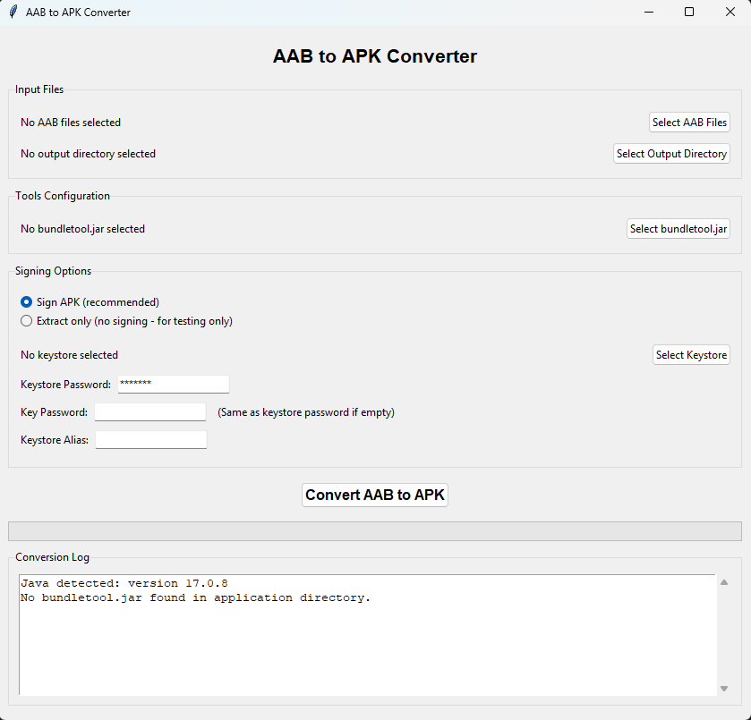

# AAB to APK Converter

A simple, user-friendly GUI tool to convert Android App Bundle (.aab) files to Android Package (.apk) files without requiring complex command-line operations.



## Tech Stack

- **Python**: Core application logic
- **Tkinter**: GUI framework for the user interface
- **Bundletool**: Google's official tool for working with Android App Bundles
- **Java**: Required runtime for executing bundletool commands
- **PyInstaller**: Used to package the Python application as a standalone Windows executable
- **Threading**: For non-blocking UI during conversion operations
- **Subprocess**: For executing Java commands from within Python

## Features

- **Simple GUI Interface**: Convert AAB files with just a few clicks
- **Batch Conversion**: Convert multiple AAB files at once
- **Signing Options**: Choose between signed and unsigned APKs
- **Java Detection**: Automatic Java detection with helpful installation guide
- **Unity Support**: Special options for Unity-generated keystores
- **Detailed Logging**: See exactly what's happening during conversion

## Requirements

- **Java JDK 8+**: Required for running bundletool
- **bundletool.jar**: Google's official tool for working with AAB files (included or downloadable)
- **Python 3.6+**: Only needed if running from source (not required for exe version)

## Installation

### Option 1: Executable Version (Windows)

1. Download the latest release from the [Releases](https://github.com/YOUR-USERNAME/aab-to-apk-converter/releases) page
2. Extract the ZIP file to a location of your choice
3. Make sure `bundletool.jar` is in the same directory as the executable
4. Run `AAB_to_APK_Converter.exe`

### Option 2: From Source (Cross-platform)

1. Clone this repository:
   ```
   git clone https://github.com/YOUR-USERNAME/aab-to-apk-converter.git
   ```
2. Install Python 3.6+ if not already installed
3. Run the application:
   ```
   python aab_to_apk_converter.py
   ```

### Building from Source

To create your own executable:
1. Ensure Python is installed
2. Run the build script:
   ```
   ./Create GUI-EXE.bat
   ```
3. Find the executable in the `dist` folder

## Usage

1. **Select AAB Files**: Click "Select AAB Files" and choose one or more .aab files
2. **Choose Output Directory**: Select where you want the converted APK files to be saved
3. **Configure Tools**: Select bundletool.jar (if not automatically detected)
4. **Signing Options**:
   - **Sign APK**: Sign the APK with a keystore (recommended for distribution)
   - **Extract Only**: Create an unsigned APK (for testing)
5. **If Signing**:
   - Select a keystore file
   - Enter keystore password
   - Enter key password (if different from keystore password)
   - Provide keystore alias
6. **Convert**: Click "Convert AAB to APK" to start the conversion process
7. **Monitor Progress**: The log window shows detailed information about the conversion process

## Common Issues

### Java Not Found
The application requires Java to run bundletool. If Java is not detected, the application will guide you to install it.

### Keystore Password Issues
If you're having trouble with keystore passwords (especially with Unity keystores):
1. Try the "Extract Only" mode first
2. For Unity keystores, try common aliases like "androiddebugkey" or your app name
3. Check if your key password is different from your keystore password

### Missing bundletool.jar
The application looks for bundletool.jar in the same directory. If not found, you'll need to select it manually.

## License

This project is open source.

## Acknowledgements

- [Google Bundletool](https://developer.android.com/studio/command-line/bundletool) - The core tool used for AAB conversion
